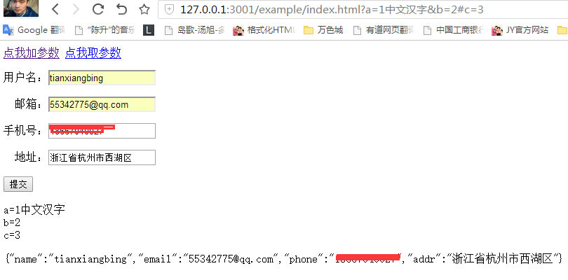

# query
对表单和url的操作
[DEMO请点我](http://lovewebgames.com/jsmodule/query.html "query")

如图所示，它的主要作用就是取url的参数，和格式化form表单里的参数。
# 用法

	Query.getQuery('a')
	var json = Query.getForm($('#form'));

# 参数说明
## getQuery: (argname,type,win)
	取url参数
	argname 是要取的参数名，如a=1这里要传"a";
	type是指取的类型，默认是"?"，可以传"#"取锚点值
	win是指要取的window对象，默认为当前的window.
##getForm:(form)
	取form参数
	form为当前的dom节点，可以是div或其他的类型的节点，不一定要<form>